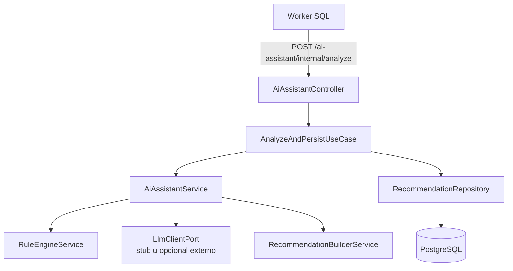

# Asistente IA - SQL Judge

## 1. Objetivo

El modulo `ai-assistant` genera recomendaciones de optimizacion SQL para apoyar el aprendizaje del estudiante despues de la evaluacion automatica. No reemplaza al comparador ni decide por si solo si una consulta es correcta; usa el resultado del runner, el schema y las metricas de ejecucion para producir feedback tecnico.

La implementacion final usa un enfoque hibrido:

- Reglas deterministicas para detectar malas practicas.
- Cliente LLM opcional o stub para redactar explicaciones.
- Builder para normalizar la salida.
- Repositorio Prisma para persistir `Recommendation`.

---

## 2. Componentes

```text
src/modules/ai-assistant/
├── domain/
│   ├── ai-assistant.port.ts
│   ├── llm-client.port.ts
│   ├── recommendation.entity.ts
│   └── recommendation.repository.ts
├── application/
│   ├── ai-assistant.service.ts
│   ├── rule-engine.service.ts
│   ├── recommendation-builder.service.ts
│   ├── dto/analyze.dto.ts
│   ├── use-cases/analyze-and-persist.use-case.ts
│   └── rules/
├── infrastructure/
│   ├── stub-llm.client.ts
│   └── prisma-recommendation.repository.ts
├── presentation/
│   └── ai-assistant.controller.ts
└── ai-assistant.module.ts
```



---

## 3. Endpoints

| Endpoint | Uso | Seguridad |
|----------|-----|-----------|
| `POST /api/ai-assistant/analyze` | Prueba manual del motor de recomendaciones. | JWT, roles `PROFESSOR` y `ADMIN`. |
| `POST /api/ai-assistant/internal/analyze` | Invocacion interna del worker; genera y persiste la recomendacion. | Red interna Docker Compose. |

El endpoint interno recibe `submissionId` y retorna tambien `recommendationId` y `shouldRequireOptimization`.

---

## 4. Contrato de entrada y salida

Entrada:

```ts
interface AiAnalysisInput {
  query: string;
  schemaDdl: string;
  executionTimeMs: number;
  explainPlan: string | null;
  status:
    | 'ACCEPTED'
    | 'WRONG_ANSWER'
    | 'SYNTAX_ERROR'
    | 'TIME_LIMIT_EXCEEDED'
    | 'RUNTIME_ERROR'
    | 'OPTIMIZATION_REQUIRED';
}
```

Salida:

```ts
interface AiAnalysisOutput {
  explanation: string;
  suggestedIndexes: string[];
  rewriteSql: string | null;
  warnings: RuleWarning[];
  impact: string;
  qualityScore?: {
    goodPractices?: number;
    clarity?: number;
    improvement?: number;
  };
}

interface RuleWarning {
  ruleId: string;
  severity: 'info' | 'warning' | 'critical';
  message: string;
}
```

---

## 5. Reglas implementadas

| Regla | Severidad | Disparador |
|-------|-----------|------------|
| `SELECT_STAR` | `warning` | La query usa `SELECT *`. |
| `MISSING_WHERE` | `warning` | Consulta sobre tabla real sin `WHERE` ni `LIMIT`. |
| `FUNCTION_IN_WHERE` | `warning` | Funcion aplicada sobre columna dentro del `WHERE`. |
| `ORDER_BY_WITHOUT_LIMIT` | `info` | `ORDER BY` sin `LIMIT`. |
| `JOIN_WITHOUT_ON` | `warning` o `critical` | Join implicito o `CROSS JOIN`. |
| `GROUP_BY_WITHOUT_FILTER` | `warning` | `GROUP BY` sin filtros o limites. |
| `SLOW_QUERY` | `critical` | `executionTimeMs` supera `AI_SLOW_QUERY_THRESHOLD_MS`. |

Una submission correcta puede terminar en `OPTIMIZATION_REQUIRED` si el comparador la acepta, pero el asistente detecta una alerta critica.

---

## 6. Persistencia

Las recomendaciones se guardan en la tabla `recommendations`, separada de `submissions`.

```prisma
model Recommendation {
  id               String
  submissionId     String
  explanation      String
  suggestedIndexes String[]
  rewriteSql       String?
  warnings         Json
  impact           String
  highestSeverity  RuleSeverity
  qualityScore     Json?
}
```

Esto permite:

- Historial de recomendaciones por submission.
- Consultas futuras para reportes.
- Separacion clara entre resultado automatico y feedback de optimizacion.

---

## 7. Variables de entorno

| Variable | Default | Descripcion |
|----------|---------|-------------|
| `LLM_PROVIDER` | `stub` | Proveedor de explicaciones: `stub`, `openai`, `anthropic`, `ollama`. |
| `LLM_API_KEY` | vacio | Llave del proveedor si se usa LLM real. |
| `LLM_MODEL` | vacio | Modelo externo. |
| `LLM_BASE_URL` | vacio | URL custom para proveedores compatibles. |
| `AI_SLOW_QUERY_THRESHOLD_MS` | `800` | Umbral de regla `SLOW_QUERY`. |

La entrega final puede ejecutarse completamente con `LLM_PROVIDER=stub`.

---

## 8. Ejemplo manual

```http
POST /api/ai-assistant/analyze
Authorization: Bearer <token-professor>
Content-Type: application/json

{
  "query": "SELECT * FROM orders WHERE UPPER(status) = 'PAID'",
  "schemaDdl": "CREATE TABLE orders (id INT, status VARCHAR(20));",
  "executionTimeMs": 1200,
  "explainPlan": null,
  "status": "ACCEPTED"
}
```

Respuesta resumida:

```json
{
  "explanation": "La consulta se ejecuto correctamente, pero tiene oportunidades de mejora.",
  "suggestedIndexes": ["CREATE INDEX ..."],
  "rewriteSql": null,
  "warnings": [
    {
      "ruleId": "SELECT_STAR",
      "severity": "warning",
      "message": "Evita seleccionar columnas innecesarias."
    }
  ],
  "impact": "Reducir columnas y funciones sobre filtros puede mejorar el rendimiento.",
  "qualityScore": {
    "goodPractices": 7,
    "clarity": 4,
    "improvement": 6
  }
}
```
