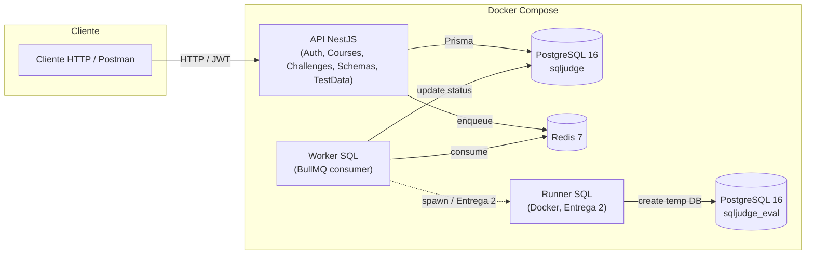
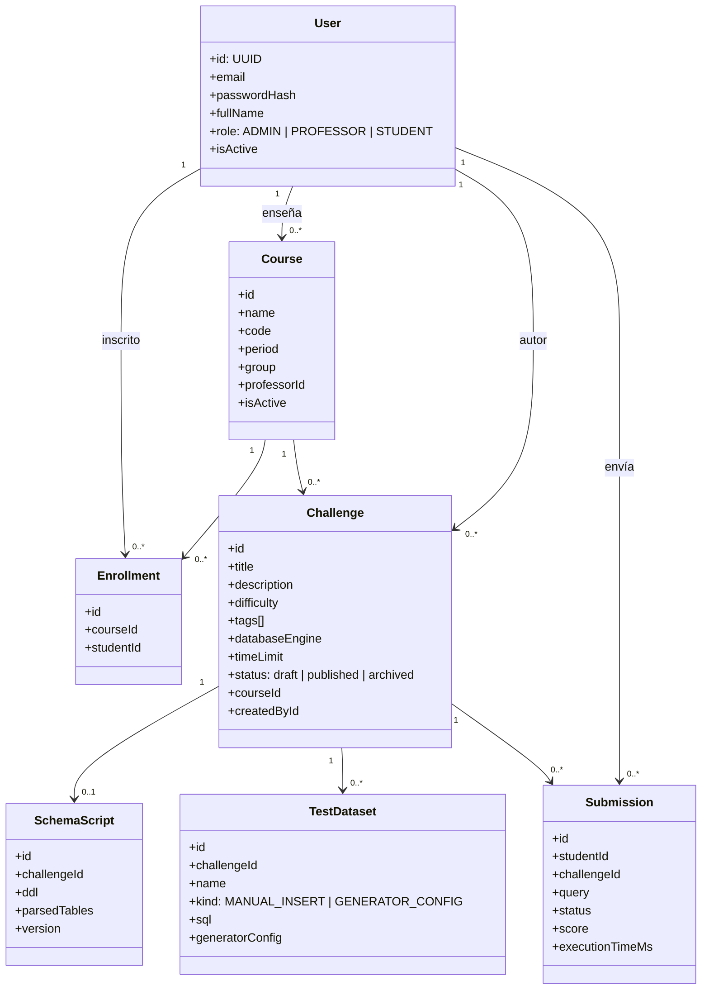
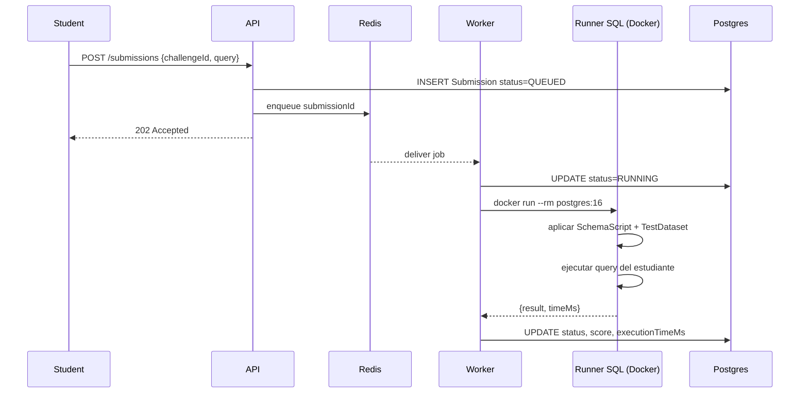

# Arquitectura — SQL Judge

> **Owner:** Dayana Molina (Líder de arquitectura).
> Cualquier cambio significativo a este documento debe revisarse con el equipo
> en la daily.

---

## 1. Vista de despliegue (alto nivel)



Notas:
- `sqljudge_eval` queda creado por `scripts/init-db.sql` y será usado por el
  Runner SQL en la Entrega 2 para crear bases temporales por evaluación.
- En Entrega 1 el worker es **stub**: solo simula el ciclo `QUEUED → RUNNING → ACCEPTED`.

---

## 2. Modelo de dominio



### Invariantes principales

- `Course.code` es único por toda la plataforma (fácil de relajar a "único por
  período" si el equipo lo decide; ver TODO en `Sofia` / Courses).
- Solo el `professorId` del curso puede crear retos en él.
- Un `Challenge` solo se puede archivar si no tiene submissions activas
  (TODO Ruiz, validación en Entrega 2 cuando exista la cola real).
- Transiciones de estado del reto:
  `draft → published`, `draft → archived`, `published → archived`. Nada más.
- `SchemaScript` es 1‑a‑1 con `Challenge`: si se sube uno nuevo, se incrementa `version`.

---

## 3. Vista de componentes (Clean Architecture)

```mermaid
flowchart TB
  subgraph Presentation
    Ctrl["REST Controllers<br/>(@Controller / DTOs / Swagger)"]
  end
  subgraph Application
    UC["Use cases / Services<br/>(orquestan dominio)"]
    DTOS["DTOs (validación)"]
  end
  subgraph Domain
    Ent["Entidades + Value Objects"]
    Ports["Puertos (interfaces)<br/>USER_REPOSITORY, ..."]
    DomEx["DomainException"]
  end
  subgraph Infrastructure
    PrismaR["Adaptadores Prisma<br/>(implementan puertos)"]
    Bull["BullMQ Producers"]
    JwtImpl["Passport-JWT, Guards"]
  end

  Ctrl --> UC
  UC --> Ports
  Ports <.. PrismaR
  UC --> Ent
  UC --> Bull
  Ctrl --> JwtImpl
  PrismaR --> PG[("Prisma -> Postgres")]
```

### Reglas de dependencia

- `domain` no depende de NADIE (sin imports de Nest, Prisma, etc.).
- `application` puede depender de `domain` y de DTOs/utilities.
- `infrastructure` implementa puertos de `domain` y orquesta clientes externos.
- `presentation` depende de `application`. NO toca repositorios ni Prisma directo.

Cualquier import "hacia adentro" (`presentation → infrastructure`, `application → infrastructure`)
es un **smell** y debe revisarse en PR.

---

## 4. Flujo end-to-end objetivo (entrega 2)



En **Entrega 1** los pasos sombreados (`Run`) están stubeados.

---

## 5. Decisiones arquitectónicas (ADR-condensado)

| ID  | Decisión                                                       | Estado      |
|-----|----------------------------------------------------------------|-------------|
| 001 | NestJS sobre Express por familiaridad del equipo               | Adoptado    |
| 002 | Prisma como ORM (en lugar de TypeORM) por type-safety y DX     | Adoptado    |
| 003 | BullMQ para colas (en lugar de RabbitMQ) por simplicidad       | Adoptado    |
| 004 | Clean Architecture por bounded context, no global              | Adoptado    |
| 005 | JWT con par access+refresh (1h / 7d)                           | Adoptado    |
| 006 | DB separada `sqljudge_eval` para runner; nunca tocar la principal | Adoptado |
| 007 | Migraciones aplicadas automáticamente al arrancar la API       | Adoptado    |

Si una decisión cambia, abrir PR a este archivo y notificar en daily.

---

## 6. Diagramas exportables

Los diagramas Mermaid se renderizan directamente en GitHub. Si Dayana necesita
PNG/draw.io para el PDF de entrega, exportar desde
<https://mermaid.live> o desde la extensión de VS Code.
