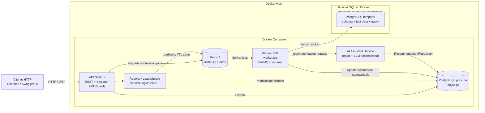
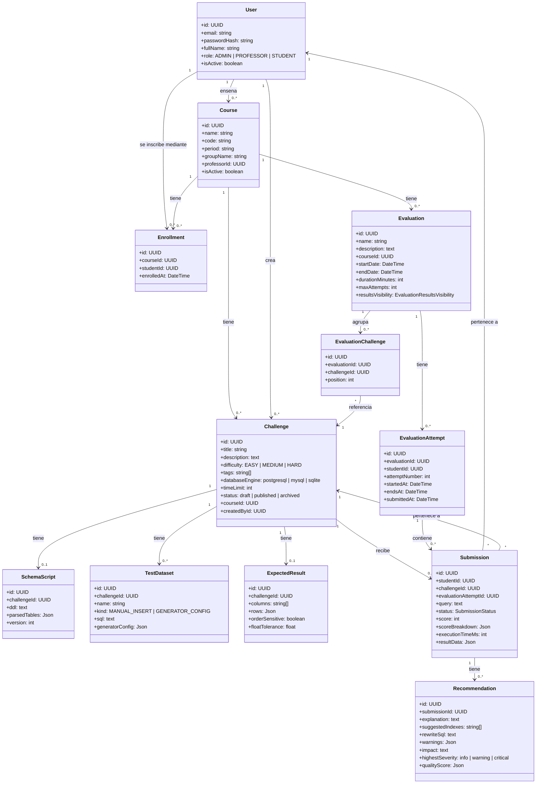
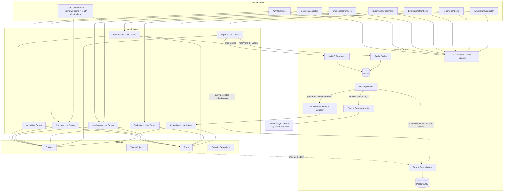
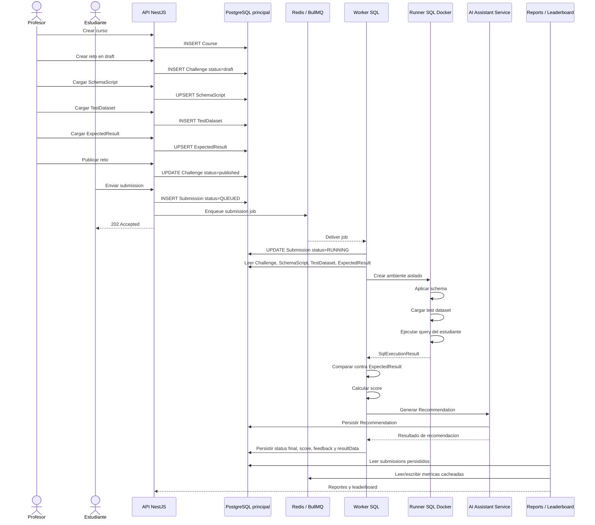
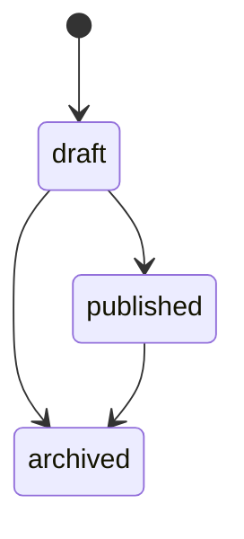
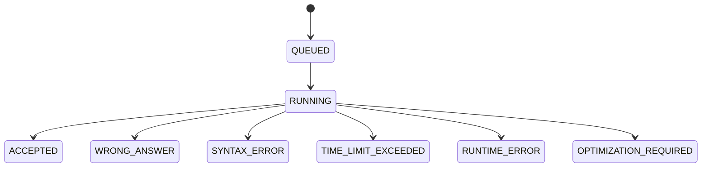
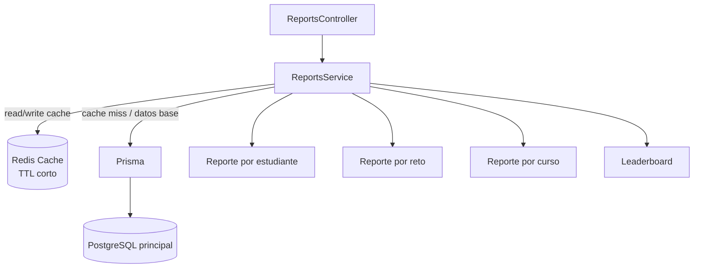
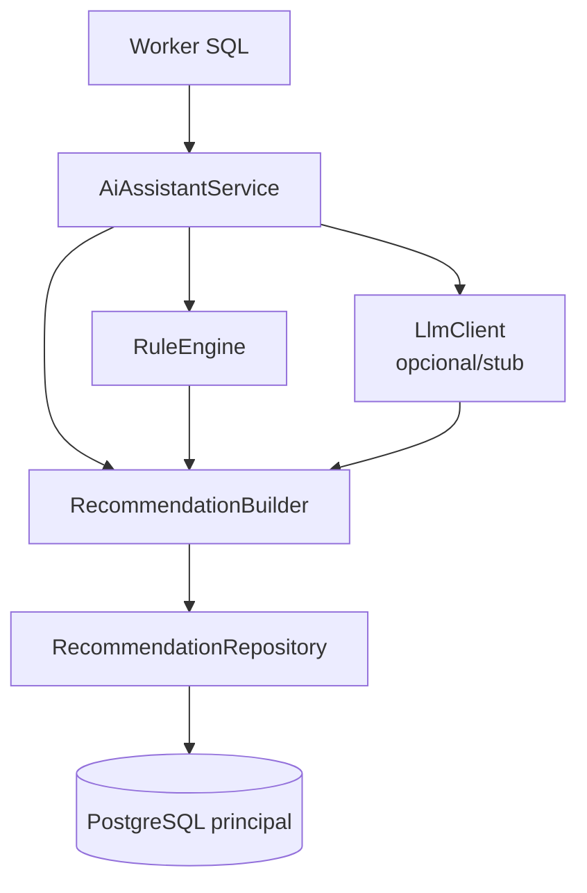

# Arquitectura - SQL Judge

> **Owner:** Dayana Molina, lider de arquitectura.
> Este documento describe la arquitectura de la implementacion final del backend SQL Judge.

---

## 1. Contexto del sistema

SQL Judge es una plataforma backend para crear cursos, retos SQL, datasets de prueba, resultados esperados, evaluaciones, submissions, reportes academicos y recomendaciones automaticas de mejora sobre consultas SQL.

La implementacion final incluye los siguientes modulos NestJS:

- `auth`
- `users`
- `courses`
- `challenges`
- `schemas`
- `test-data`
- `submissions`
- `evaluations`
- `ai-assistant`
- `reports`
- `demo`
- `health`

El sistema usa NestJS, Prisma, PostgreSQL, Redis, BullMQ, Docker Compose, JWT y un worker independiente ubicado en `worker/src`.

---

## 2. Vista de despliegue

Notas operativas:

- La base principal `sqljudge` almacena usuarios, cursos, retos, schemas, datasets, resultados esperados, submissions, evaluaciones, reportes derivados y recomendaciones.
- La base principal no ejecuta SQL enviado por estudiantes.
- El SQL de estudiantes se ejecuta unicamente en el Runner SQL, dentro de un contenedor Docker temporal y aislado.
- El runner aplica `SchemaScript`, carga `TestDataset`, ejecuta la query del estudiante y destruye el ambiente al finalizar.
- El runner opera con limites de CPU, memoria y tiempo de ejecucion.
- Redis se usa para BullMQ y para cache de reportes/leaderboard.

---

## 3. Modelo de dominio

### Invariantes principales

- Solo profesores y administradores pueden crear cursos, retos, schemas, datasets y resultados esperados.
- Un `Course` pertenece a un profesor mediante `professorId`.
- Un estudiante se vincula a un curso mediante `Enrollment`.
- Un `Challenge` pertenece a un curso y se publica solo cuando tiene los insumos necesarios.
- Un `Challenge` puede tener un `SchemaScript`, multiples `TestDataset` y un `ExpectedResult`.
- Un `ExpectedResult` existe como entidad separada para permitir comparacion deterministica.
- Una `Evaluation` agrupa retos mediante `EvaluationChallenge`.
- Una `EvaluationAttempt` representa el intento de un estudiante dentro de una evaluacion.
- Una `Submission` pertenece a un estudiante y a un reto.
- Una `Submission` puede pertenecer a una `EvaluationAttempt`.
- Las `Recommendation` se persisten como entidad separada asociada a la submission evaluada.
- El SQL de estudiantes nunca se ejecuta en la base principal.

---

## 4. Vista de componentes - Clean Architecture

### Reglas de dependencia

- `domain` no depende de NestJS, Prisma, BullMQ, Redis ni Docker.
- `application` orquesta casos de uso y depende de abstracciones del dominio.
- `infrastructure` implementa persistencia, colas, cache, runner, guardas JWT y adaptadores externos.
- `presentation` expone controladores HTTP, DTOs, Swagger y guardas.
- El modulo de submissions encola trabajos en BullMQ.
- El worker consume trabajos, usa el runner aislado y consulta el asistente IA.
- Reports calcula metricas desde datos persistidos y usa Redis Cache para consultas pesadas.

---

## 5. Flujo end-to-end final

---

## 6. Estados de Challenge

Reglas:

- `draft`: reto editable, todavia no disponible para estudiantes.
- `published`: reto disponible para submissions.
- `archived`: reto cerrado para nuevas submissions.

---

## 7. Estados de Submission

Estados finales:

- `ACCEPTED`: resultado correcto.
- `WRONG_ANSWER`: la query ejecuta, pero no coincide con `ExpectedResult`.
- `SYNTAX_ERROR`: error de sintaxis SQL.
- `TIME_LIMIT_EXCEEDED`: supero el limite de tiempo configurado.
- `RUNTIME_ERROR`: error de ejecucion o fallo del runner.
- `OPTIMIZATION_REQUIRED`: la respuesta puede ser correcta, pero requiere mejoras relevantes detectadas por el asistente.

---

## 8. Seguridad de ejecucion SQL

La ejecucion de SQL de estudiantes se considera entrada no confiable.

Reglas obligatorias:

- La API HTTP nunca ejecuta SQL de estudiantes.
- La base principal `sqljudge` nunca ejecuta SQL de estudiantes.
- Toda submission entra por cola y se procesa de forma asincrona.
- El worker crea un ambiente Docker temporal para cada evaluacion.
- El runner aplica schema y test data en una base temporal.
- El runner ejecuta solo consultas permitidas y con timeout.
- El contenedor del runner se destruye al finalizar, incluso ante error.
- El runner usa limites de CPU, memoria y tiempo.
- Se bloquean operaciones destructivas o administrativas como `DROP`, `DELETE`, `UPDATE`, `ALTER`, `TRUNCATE`, `GRANT` y `REVOKE`.
- Los resultados se comparan contra `ExpectedResult`, no contra consultas ejecutadas en la base principal.

---

## 9. Diagrama de reportes

Los reportes y leaderboard se calculan desde submissions persistidos. Redis se usa como cache de TTL corto para evitar recomputar consultas pesadas de forma innecesaria.

---

## 10. Diagrama de AI Assistant

El asistente usa un enfoque hibrido: reglas deterministicas para detectar patrones conocidos y un cliente LLM opcional o stub para enriquecer la explicacion. Las recomendaciones se persisten como entidad separada.

---

## 11. Decisiones arquitectonicas

| ID | Decision | Estado |
|----|----------|--------|
| ADR-001 | NestJS como framework backend principal por modularidad, DI y soporte para arquitectura por capas. | Adoptada |
| ADR-002 | Prisma como ORM para type-safety, migraciones y claridad del modelo relacional. | Adoptada |
| ADR-003 | PostgreSQL como base principal para persistencia transaccional. | Adoptada |
| ADR-004 | Redis como infraestructura compartida para BullMQ y cache de reportes. | Adoptada |
| ADR-005 | JWT y guards por roles para autenticacion y autorizacion HTTP. | Adoptada |
| ADR-006 | Clean Architecture por modulo para separar presentation, application, domain e infrastructure. | Adoptada |
| ADR-007 | La base principal no ejecuta SQL de estudiantes. | Adoptada |
| ADR-008 | Runner SQL en Docker para aislamiento de ejecucion. | Adoptada |
| ADR-009 | Evaluacion asincrona con BullMQ para desacoplar API y ejecucion SQL. | Adoptada |
| ADR-010 | ExpectedResult separado para comparacion deterministica. | Adoptada |
| ADR-011 | IA hibrida basada en reglas y cliente LLM opcional/stub. | Adoptada |
| ADR-012 | Recommendations persistidas como entidad separada. | Adoptada |
| ADR-013 | Leaderboard calculado desde submissions persistidos. | Adoptada |
| ADR-014 | Reportes pesados cacheados en Redis con TTL corto. | Adoptada |
| ADR-015 | Worker independiente en `worker/src` para procesar submissions y operar el runner. | Adoptada |
| ADR-016 | Runner con limites de CPU, memoria y tiempo para controlar riesgo operativo. | Adoptada |

Si una decision cambia, se debe actualizar este documento y el ADR correspondiente antes de mergear.

---
