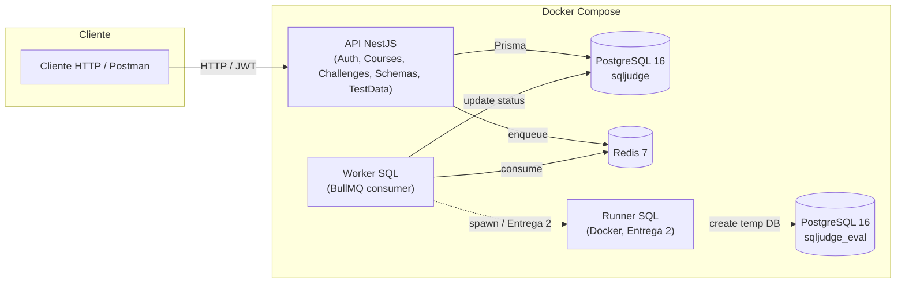
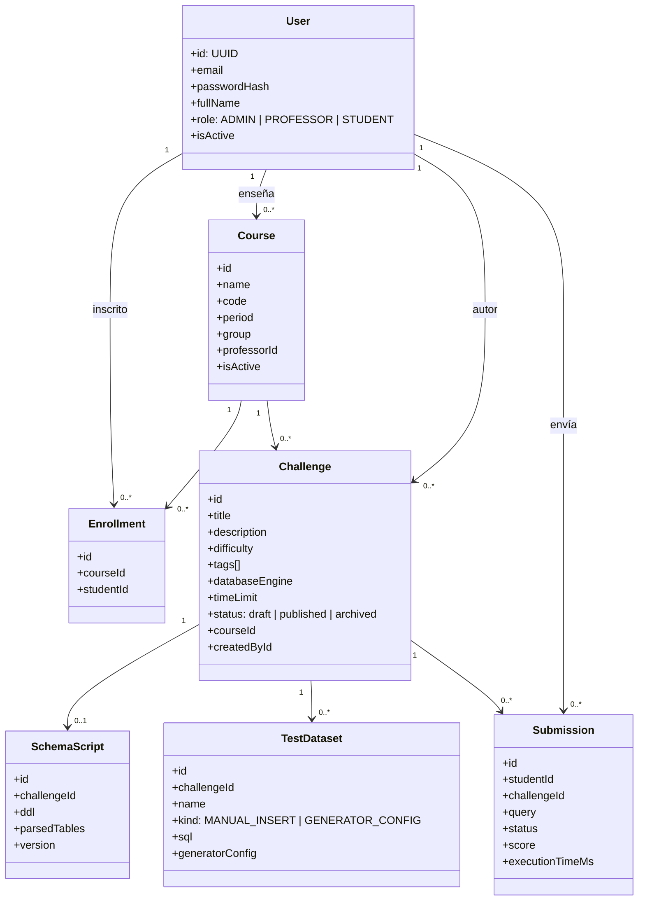
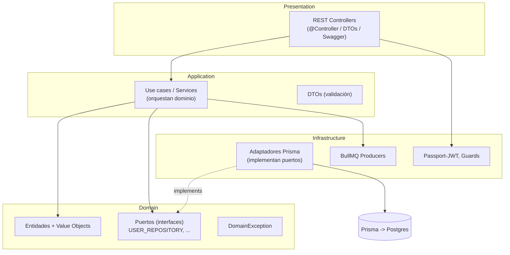
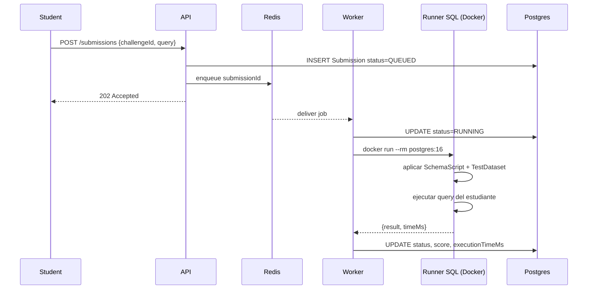

# Arquitectura — SQL Judge

> **Owner:** Dayana Molina (Líder de arquitectura).
> Cualquier cambio significativo a este documento debe revisarse con el equipo
> en la daily.

---

## 1. Vista de despliegue (alto nivel)



Notas:
- `sqljudge_eval` queda creado por `scripts/init-db.sql` y será usado por el
  Runner SQL en la Entrega 2 para crear bases temporales por evaluación.
- En Entrega 1 el worker es **stub**: solo simula el ciclo `QUEUED → RUNNING → ACCEPTED`.

### Mejoras pendientes para Entrega 2

- Agregar explícitamente el `AI Recommendation Service` como componente consumido por el Worker.
- Representar el runner como un ambiente efímero, no como una base fija reutilizada.
- Aclarar que `sqljudge_eval` solo sirve como base auxiliar o de preparación, pero no reemplaza el aislamiento por evaluación.
- Documentar que la base principal `sqljudge` nunca ejecuta SQL enviado por estudiantes.
- Añadir límites operativos del runner:
  - timeout por evaluación,
  - límite de memoria,
  - límite de CPU,
  - eliminación del contenedor al finalizar.
---

## 2. Modelo de dominio


### Entidades candidatas para completar el dominio

Para cubrir completamente los módulos de evaluaciones, resultados y recomendaciones,
se propone extender el modelo con las siguientes entidades en Entrega 2:

- `Evaluation`: representa una evaluación o parcial compuesto por uno o varios retos.
- `EvaluationChallenge`: tabla intermedia entre evaluaciones y retos.
- `SubmissionTestResult`: detalle por caso de prueba ejecutado para un submission.
- `Recommendation`: recomendaciones generadas por el asistente inteligente.
- `ExecutionMetric`: métricas técnicas de ejecución como tiempo, memoria y estado del runner.


### Invariantes principales

- `Course.code` es único por toda la plataforma (fácil de relajar a "único por
  período" si el equipo lo decide; ver TODO en `Sofia` / Courses).
- Solo el `professorId` del curso puede crear retos en él.
- Un `Challenge` solo se puede archivar si no tiene submissions activas
  (TODO Ruiz, validación en Entrega 2 cuando exista la cola real).
- Transiciones de estado del reto:
  `draft → published`, `draft → archived`, `published → archived`. Nada más.
- `SchemaScript` es 1‑a‑1 con `Challenge`: si se sube uno nuevo, se incrementa `version`.
- Un estudiante no puede enviar soluciones fuera de la ventana activa de una evaluación.
- Cada evaluación debe respetar un máximo de intentos por estudiante y reto.
- Un `Submission` solo debe evaluarse una vez.
- Solo se permiten consultas `SELECT` durante la evaluación automática.
- Toda consulta SQL debe validarse antes de enviarse al runner.
- Los resultados esperados deben normalizarse antes de compararse con el resultado del estudiante.
- Las recomendaciones de optimización deben quedar asociadas al `Submission` evaluado.
---

## 3. Vista de componentes (Clean Architecture)



### Reglas de dependencia

- `domain` no depende de NADIE (sin imports de Nest, Prisma, etc.).
- `application` puede depender de `domain` y de DTOs/utilities.
- `infrastructure` implementa puertos de `domain` y orquesta clientes externos.
- `presentation` depende de `application`. NO toca repositorios ni Prisma directo.

Cualquier import "hacia adentro" (`presentation → infrastructure`, `application → infrastructure`)
es un **smell** y debe revisarse en PR.

### Puertos recomendados para Entrega 2

Para mantener el desacoplamiento entre aplicación e infraestructura,
los componentes nuevos deben exponerse mediante puertos del dominio o de aplicación.

Puertos sugeridos:

- `SubmissionRepository`: persistencia de submissions y resultados.
- `SubmissionQueuePort`: publicación de trabajos en BullMQ.
- `SqlRunnerPort`: ejecución aislada de consultas SQL.
- `RecommendationServicePort`: generación de recomendaciones SQL.
- `EvaluationRepository`: persistencia de evaluaciones y retos asociados.
- `ExecutionMetricsRepository`: persistencia de métricas de ejecución.

Reglas:
- La capa de aplicación no debe conocer BullMQ directamente fuera del adaptador.
- El Worker debe depender de puertos, no de implementaciones concretas.
- El Runner debe exponerse como adaptador de infraestructura.
- El servicio de recomendaciones debe poder cambiar entre reglas, IA generativa o enfoque híbrido sin afectar los casos de uso.
---

## 4. Flujo end-to-end objetivo (entrega 2)



En **Entrega 1** los pasos sombreados (`Run`) están stubeados.

### Extensión del flujo para recomendaciones SQL

Después de ejecutar la consulta del estudiante, el Worker debe solicitar
recomendaciones al servicio de optimización SQL.

Flujo adicional:

1. El Worker recibe el resultado de ejecución del Runner.
2. El Worker recopila:
   - consulta enviada,
   - esquema del reto,
   - datos de rendimiento,
   - estado de evaluación,
   - posibles errores.
3. El Worker invoca el `RecommendationServicePort`.
4. El servicio de recomendaciones analiza la consulta.
5. Se generan:
   - explicación en lenguaje natural,
   - sugerencia de índices,
   - advertencias de malas prácticas,
   - posible reescritura de la consulta.
6. El Worker persiste el resultado final y las recomendaciones.


---

## 5. Seguridad de ejecución SQL

La ejecución de SQL enviado por estudiantes es el punto de mayor riesgo técnico
del sistema. Por eso, debe tratarse como entrada no confiable.

Reglas obligatorias:

- Nunca ejecutar consultas de estudiantes desde la API HTTP.
- Toda consulta debe pasar por cola, Worker y Runner aislado.
- El runner nunca debe conectarse a la base principal `sqljudge`.
- Solo se permiten consultas `SELECT` para evaluación automática.
- Bloquear operaciones destructivas o administrativas:
  - `DROP`
  - `DELETE`
  - `UPDATE`
  - `ALTER`
  - `TRUNCATE`
  - `CREATE USER`
  - `GRANT`
  - `REVOKE`

- Validar la consulta mediante parser SQL antes de enviarla al runner.
- Aplicar límite de tiempo por ejecución.
- Aplicar límites de CPU y memoria al contenedor.
- Eliminar el ambiente temporal al finalizar la evaluación.

---

## 6. Estados de Challenge

```mermaid
stateDiagram-v2
  [*] --> draft
  draft --> published
  draft --> archived
  published --> archived
 ``` 

---

## 7. Estados de Submission

```mermaid
stateDiagram-v2
  [*] --> QUEUED
  QUEUED --> RUNNING
  RUNNING --> ACCEPTED
  RUNNING --> WRONG_ANSWER
  RUNNING --> SYNTAX_ERROR
  RUNNING --> TIME_LIMIT_EXCEEDED
  RUNNING --> RUNTIME_ERROR
  RUNNING --> OPTIMIZATION_REQUIRED
 ``` 
---

## 8. Decisiones arquitectónicas (ADR-condensado)

| ID  | Decisión | Estado |
|-----|-----------|---------|
| 001 | NestJS sobre Express por familiaridad del equipo | Adoptado |
| 002 | Prisma como ORM (en lugar de TypeORM) por type-safety y DX | Adoptado |
| 003 | BullMQ para colas (en lugar de RabbitMQ) por simplicidad | Adoptado |
| 004 | Clean Architecture por bounded context, no global | Adoptado |
| 005 | JWT con par access+refresh (1h / 7d) | Adoptado |
| 006 | DB separada `sqljudge_eval` para runner; nunca tocar la principal | Adoptado |
| 007 | Migraciones aplicadas automáticamente al arrancar la API | Adoptado |
| 008 | Solo se permiten consultas SELECT en evaluación automática | Adoptado |
| 009 | Toda evaluación SQL será asíncrona vía Redis + BullMQ | Adoptado |
| 010 | El sistema usará enfoque híbrido reglas + IA para recomendaciones | Adoptado |
| 011 | Cada evaluación correrá en un ambiente efímero aislado | Adoptado |
| 012 | El runner tendrá límites de CPU, memoria y tiempo | Adoptado |
| 013 | Los resultados esperados se normalizarán antes de comparar | Propuesto |

Si una decisión cambia, abrir PR a este archivo y notificar en daily.

---

## 9. Diagramas exportables

Los diagramas Mermaid se renderizan directamente en GitHub. Si Dayana necesita
PNG/draw.io para el PDF de entrega, exportar desde
<https://mermaid.live> o desde la extensión de VS Code.
