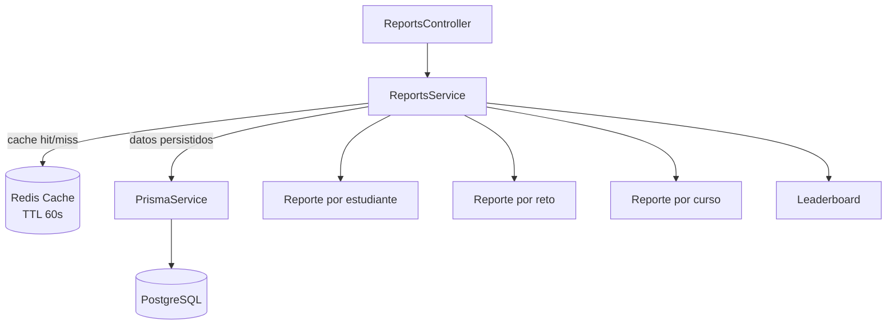

# Reports y Leaderboard - SQL Judge

## 1. Objetivo

El modulo `reports` permite consultar metricas academicas de la plataforma a partir de submissions persistidas. Esta informacion sirve para profesores, administradores y estudiantes durante la revision de resultados.

---

## 2. Endpoints

| Endpoint | Roles | Descripcion |
|----------|-------|-------------|
| `GET /api/reports/students/:id` | `ADMIN`, `PROFESSOR` | Reporte academico de un estudiante. |
| `GET /api/reports/challenges/:id` | `ADMIN`, `PROFESSOR` | Desempeno de un reto. |
| `GET /api/reports/courses/:id` | `ADMIN`, `PROFESSOR` | Resumen academico de un curso. |
| `GET /api/reports/leaderboard` | `ADMIN`, `PROFESSOR`, `STUDENT` | Ranking agregado. |

Parametros opcionales de leaderboard:

```http
GET /api/reports/leaderboard?courseId=<uuid>&evaluationId=<uuid>
```

---

## 3. Metricas

Reporte por estudiante:

- Retos resueltos.
- Total de submissions.
- Score promedio.
- Mejor tiempo de ejecucion.

Reporte por reto:

- Total de submissions.
- Submissions aceptadas.
- Tasa de exito.
- Mejor tiempo de ejecucion.
- Dificultad real estimada.

Reporte por curso:

- Score promedio del curso.
- Top 5 estudiantes.
- Retos mas dificiles.

Leaderboard:

- Score total acumulado.
- Retos resueltos.
- Total de submissions.
- Mejor tiempo de ejecucion.

---

## 4. Fuente de datos

Los reportes se calculan desde:

- `submissions`
- `challenges`
- `evaluation_attempts`
- relaciones de curso y evaluacion

El runner no se consulta para reportes. Toda metrica sale de resultados persistidos.

---

## 5. Cache Redis

Las consultas se cachean en Redis con TTL de 60 segundos.

Claves principales:

```text
reports:student:<studentId>
reports:challenge:<challengeId>
reports:course:<courseId>
reports:leaderboard:course:<courseId|all>:evaluation:<evaluationId|all>
```

Si Redis no esta disponible, el servicio continua calculando desde PostgreSQL y registra advertencia en logs.

---

## 6. Diagrama



---

## 7. Consideraciones

- El leaderboard ordena por `totalScore` descendente.
- La cache tiene TTL corto para mantener resultados frescos despues de nuevas submissions.
- Las metricas deben recalcularse desde base de datos si no hay cache.
- La base principal es fuente de verdad; Redis no almacena datos canonicos.
